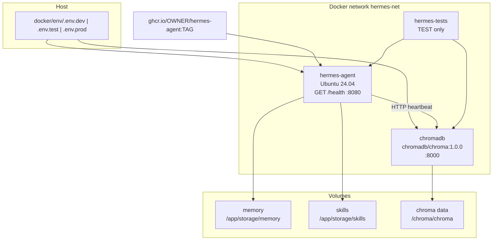
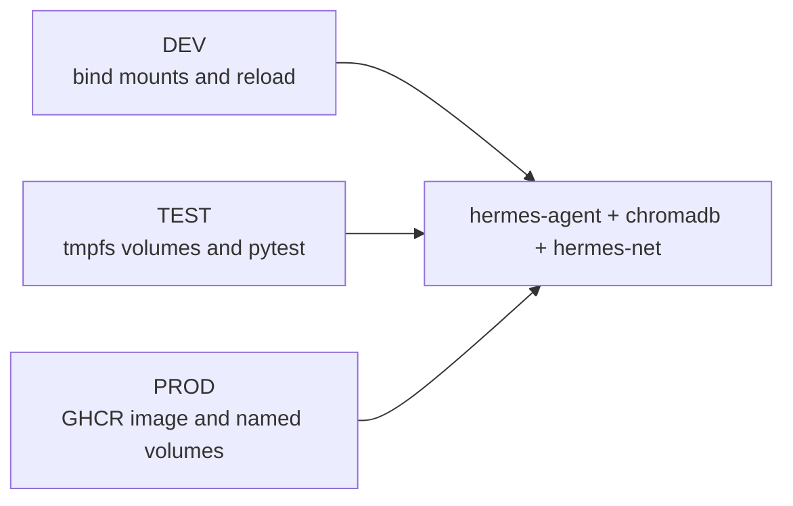

# Architecture after the container stack

Date: 2026-09-25

This snapshot is the state introduced by the initial containerized Hermes Agent.

```mermaid
flowchart TB
  subgraph host ["Host"]
    envFiles["docker/env/.env.dev | .env.test | .env.prod"]
  end

  subgraph net ["Docker network hermes-net"]
    agent["hermes-agent\nUbuntu 24.04\nGET /health :8080"]
    chroma["chromadb\nchromadb/chroma:1.0.0\n:8000"]
    tests["hermes-tests\nTEST only"]
  end

  subgraph vols ["Volumes"]
    mem["memory\n/app/storage/memory"]
    skillsVol["skills\n/app/storage/skills"]
    embeddings["chroma data\n/chroma/chroma"]
  end

  ghcr["ghcr.io/OWNER/hermes-agent:TAG"]

  envFiles --> agent
  envFiles --> chroma
  ghcr --> agent
  agent -->|"HTTP heartbeat"| chroma
  agent --> mem
  agent --> skillsVol
  chroma --> embeddings
  tests --> agent
  tests --> chroma
```

```mermaid
flowchart LR
  dev["DEV\nbind mounts and reload"]
  test["TEST\ntmpfs volumes and pytest"]
  prod["PROD\nGHCR image and named volumes"]
  dev --> stack["hermes-agent + chromadb + hermes-net"]
  test --> stack
  prod --> stack
```
